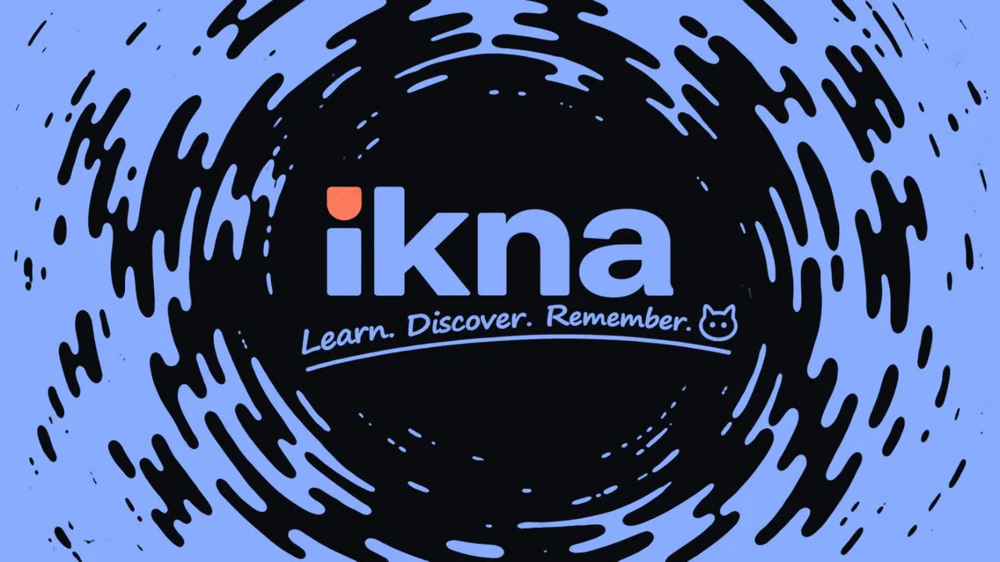

  

<h1 align="center" id="ikna"></h1>

  <strong>English</strong> · <a href="#русский">Русский</a>

  A language-learning app that decides how much new material fits into your day. 
  Android · Windows · Linux · no accounts · no telemetry

  
  
  
  
  
  
  

  <a href="https://github.com/d1d2dopamine/ikna/releases/latest"><strong>Download</strong></a>
  &nbsp;·&nbsp;
  <a href="CHANGELOG.md">Changelog</a>
  &nbsp;·&nbsp;
  <a href="docs/ARCHITECTURE.md">Developer docs</a>

## 🧩 What is ikna?

ikna teaches languages through **chunks**: a useful phrase, a natural sentence that contains it, and its meaning.

You do not build a giant card collection and then spend months managing it. ikna handles the daily load for you. Its **load governor** looks at upcoming reviews, backlog, recent accuracy and missed days, then decides whether new material fits today.

There is no streak to protect, no visible backlog counter and no four-button confidence ritual: during review you make one decision, **know** or **do not know**, and the scheduler handles the rest.

The idea is simple: studying should take attention, not administration.

### The short version

- Learn phrases in context instead of isolated word pairs.
- Answer with two intentions: **know** / **do not know**.
- Let FSRS-6 schedule recognition, cloze and production separately.
- Let the governor control how much new material enters the system.
- Import ready-made decks, generate your own, or move from Anki.
- Keep review history on your device.

## ⬇️ Download

| Platform | File |
| --- | --- |
| **Android** 10+ (`minSdk 29`), arm64 | [ikna-android-arm64.apk](https://github.com/d1d2dopamine/ikna/releases/latest/download/ikna-android-arm64.apk) |
| **Android** 10+, older 32-bit ARM | [ikna-android-legacy32.apk](https://github.com/d1d2dopamine/ikna/releases/latest/download/ikna-android-legacy32.apk) |
| **Windows** x64, installer | [ikna-windows-x64-setup.exe](https://github.com/d1d2dopamine/ikna/releases/latest/download/ikna-windows-x64-setup.exe) |
| **Windows** x64, portable | [ikna-windows-x64-portable.zip](https://github.com/d1d2dopamine/ikna/releases/latest/download/ikna-windows-x64-portable.zip) |
| **Linux** x86_64 | [ikna-linux-x86_64.AppImage](https://github.com/d1d2dopamine/ikna/releases/latest/download/ikna-linux-x86_64.AppImage) |

The links always point at the newest release. You can also [open the release page](https://github.com/d1d2dopamine/ikna/releases/latest) itself.

**Android.** The main APK is for arm64 devices; older 32-bit devices use the legacy32 file. Updates install over the previous version without discarding the review history.

**Windows.** The installer is per-user and needs no administrator rights. The portable zip needs no Java. The executable is unsigned, so SmartScreen may ask for confirmation on first launch.

**Linux.** Make the AppImage executable with `chmod +x` before launching it. No Java needed.

Desktop data is stored outside the application folder, so replacing the executable deletes nothing ([`docs/DESKTOP.md`](docs/DESKTOP.md)). Speech ships without a model: you add a Kokoro or Piper model yourself, and ikna never downloads one ([`docs/VOICE.md`](docs/VOICE.md)).

## ✨ How it works

Every review ends with one decision: **know** or **do not know**. The scheduler does the rest. FSRS-6 trains every chunk at three levels, recognition, cloze and production, and schedules them independently. How much new material fits into the day is the governor's call, made before the session starts. Once the required plan is done, familiar material appears in Browse, a reading feed with no grading. With enough local history the app can also fit FSRS parameters and refine some grades, all on-device.

More: [`docs/GRADING.md`](docs/GRADING.md) · [`docs/GOVERNOR.md`](docs/GOVERNOR.md) · [`docs/LEARNING-ENGINE.md`](docs/LEARNING-ENGINE.md) · [`docs/FSRS-OPTIMIZER.md`](docs/FSRS-OPTIMIZER.md) · [`docs/DESIGN.md`](docs/DESIGN.md)

## 🃋 Decks

Material gets into ikna three ways.

**Catalogue.** Decks built from open corpora, sentences from [Tatoeba](https://tatoeba.org); every card keeps its public source reference and licence. The published catalogue lives in the [`catalog` release](https://github.com/d1d2dopamine/ikna/releases/tag/catalog). Details: [`docs/SOURCES.md`](docs/SOURCES.md).

**Your own deck.** Plain text, three columns: `phrase | sentence containing it | translation`. The app writes the prompt for any AI model and parses the pasted answer. Format and rules: [`docs/DECKS.md`](docs/DECKS.md).

**From Anki.** Import an `.apkg` and text cards arrive with their answer history. Pictures and audio stay behind; collections over 300 MB are rejected rather than partially imported. More: [`docs/ANKI.md`](docs/ANKI.md).

Catalogue cards can carry IPA pronunciation, and each deck chooses whether to show it. A beginner en→ru deck ships inside the app, so a clean install starts with real material.

## 🔒 Privacy and data

No accounts, no telemetry. The network is used only for static files you request: release checks, catalogue files and public source links. Cards, answers, statistics and identifiers stay on the device.

The review log is append-only. Android exports it with settings to `Documents/ikna/`; desktop makes a portable backup. Restore replays the answers through the scheduler instead of copying schedule state.

See [`PRIVACY.md`](PRIVACY.md) and [`docs/UPDATES.md`](docs/UPDATES.md).

## 🎛️ Interface

Twelve palettes in two lightings, imported fonts, motion that can be switched off entirely.

Interface languages: Russian, English, Polish, Spanish, French, German and Brazilian Portuguese.

Android adds a home-screen widget and one daily reminder. Desktop ships without speech, widget or reminders.

## 🔨 Build

Push to `main` (or run the `build` workflow manually) and download the artifact you need; CI provisions Gradle itself, no wrapper jar is committed.

The full build, test and release recipes live in [`CONTRIBUTING.md`](CONTRIBUTING.md). Versioning rules: [`docs/VERSIONS.md`](docs/VERSIONS.md).

## 📚 Documentation

Start here: [`ARCHITECTURE.md`](docs/ARCHITECTURE.md) · [`DESIGN.md`](docs/DESIGN.md) · [`LEARNING-ENGINE.md`](docs/LEARNING-ENGINE.md) · [`CONTRIBUTING.md`](CONTRIBUTING.md) · [`VERSIONS.md`](docs/VERSIONS.md)

Active development: [`0.12.0 press plan`](docs/PLAN-0.12.md).
AI contributors: [`AGENTS.md`](AGENTS.md) and the repository skills linked there.

Everything else lives in [`docs/`](docs/).

## ⚖️ License

ikna is free software under the **GNU General Public License, version 3 or (at your option) any later version**. See [LICENSE](LICENSE).

---

  

<h1 align="center" id="русский"></h1>

  <a href="#ikna">English</a> · <strong>Русский</strong>

  Приложение для изучения языков, которое само решает, сколько нового материала тебе сегодня нужно. 
  Android · Windows · Linux · без аккаунтов · без телеметрии

  
  
  
  
  
  
  

  <a href="https://github.com/d1d2dopamine/ikna/releases/latest"><strong>Скачать</strong></a>
  &nbsp;·&nbsp;
  <a href="CHANGELOG.md">Изменения</a>
  &nbsp;·&nbsp;
  <a href="docs/ARCHITECTURE.md">Документация</a>

## 🧩 Что такое ikna?

ikna учит язык **кусками**: полезная фраза, естественное предложение с ней и её смысл.

Тебе не нужно сначала собирать огромную коллекцию карточек, а потом месяцами управлять ею. ikna сама регулирует дневную нагрузку. **Регулятор нагрузки** смотрит на будущие повторы, накопившийся долг, недавнюю точность и пропущенные дни, а затем решает, помещается ли сегодня новый материал.

Нет стрика, который страшно потерять, нет счётчика долгов перед глазами и нет четырёх кнопок уверенности: на повторении одно решение, **знаю** или **не знаю**, остальное делает планировщик.

Идея простая: внимание должно уходить на язык, а не на обслуживание системы карточек.

### Если совсем коротко

- Учишь фразы в контексте, а не пары «слово-перевод».
- Отвечаешь двумя намерениями: **знаю** / **не знаю**.
- FSRS-6 отдельно планирует узнавание, пропуск и производство.
- Регулятор сам ограничивает новый материал.
- Можно брать готовые колоды, делать свои или переехать из Anki.
- История ответов остаётся на устройстве.

## ⬇️ Скачать

| Платформа | Файл |
| --- | --- |
| **Android** 10+ (`minSdk 29`), arm64 | [ikna-android-arm64.apk](https://github.com/d1d2dopamine/ikna/releases/latest/download/ikna-android-arm64.apk) |
| **Android** 10+, старый 32-битный ARM | [ikna-android-legacy32.apk](https://github.com/d1d2dopamine/ikna/releases/latest/download/ikna-android-legacy32.apk) |
| **Windows** x64, установщик | [ikna-windows-x64-setup.exe](https://github.com/d1d2dopamine/ikna/releases/latest/download/ikna-windows-x64-setup.exe) |
| **Windows** x64, portable | [ikna-windows-x64-portable.zip](https://github.com/d1d2dopamine/ikna/releases/latest/download/ikna-windows-x64-portable.zip) |
| **Linux** x86_64 | [ikna-linux-x86_64.AppImage](https://github.com/d1d2dopamine/ikna/releases/latest/download/ikna-linux-x86_64.AppImage) |

Ссылки всегда ведут на самый свежий релиз. Можно и [открыть страницу релиза](https://github.com/d1d2dopamine/ikna/releases/latest) целиком.

**Android.** Основной APK для arm64; старым 32-битным устройствам нужен файл legacy32. Обновление ставится поверх предыдущей версии и не трогает журнал ответов.

**Windows.** Установщик ставится для текущего пользователя и не требует прав администратора. Portable zip не требует Java. Файл не подписан, поэтому SmartScreen при первом запуске может спросить подтверждение.

**Linux.** Перед запуском сделай AppImage исполняемым через `chmod +x`. Java не нужна.

Данные desktop-версии лежат отдельно от файлов приложения, поэтому замена исполняемого файла ничего не удаляет ([`docs/DESKTOP.md`](docs/DESKTOP.md)). Озвучка поставляется без модели: модель Kokoro или Piper ты добавляешь сам, приложение само их не скачивает ([`docs/VOICE.md`](docs/VOICE.md)).

## ✨ Как это устроено

Каждый повтор заканчивается решением: **знаю** или **не знаю**. Дальше работает планировщик. FSRS-6 тренирует каждый кусок на трёх уровнях: узнавание, пропуск, производство, и планирует их независимо. Сколько нового материала поместится в день, регулятор решает до начала сессии. Когда обязательный план закрыт, знакомые карточки появляются в Browse, ленте для чтения без оценки. Когда истории набирается достаточно, приложение может локально подобрать параметры FSRS и уточнить часть оценок, всё на устройстве.

Подробнее: [`docs/GRADING.md`](docs/GRADING.md) · [`docs/GOVERNOR.md`](docs/GOVERNOR.md) · [`docs/LEARNING-ENGINE.md`](docs/LEARNING-ENGINE.md) · [`docs/FSRS-OPTIMIZER.md`](docs/FSRS-OPTIMIZER.md) · [`docs/DESIGN.md`](docs/DESIGN.md)

## 🃋 Колоды

Материал попадает в ikna тремя путями.

**Каталог.** Колоды из открытых корпусов, предложения из [Tatoeba](https://tatoeba.org); у каждой карточки сохраняются публичная ссылка на источник и сведения о лицензии. Опубликованный каталог лежит в [релизе с тегом `catalog`](https://github.com/d1d2dopamine/ikna/releases/tag/catalog). Подробности: [`docs/SOURCES.md`](docs/SOURCES.md).

**Своя колода.** Обычный текст в три столбца: `фраза | предложение с ней | перевод`. Приложение само выдаст промпт для любой модели и разберёт вставленный ответ. Формат и правила: [`docs/DECKS.md`](docs/DECKS.md).

**Переезд из Anki.** Импортируй `.apkg`, и текстовые карточки приедут вместе с историей ответов. Картинки и звук не переносятся; коллекции тяжелее 300 МБ отклоняются целиком. Подробнее: [`docs/ANKI.md`](docs/ANKI.md).

Каталожные карточки могут содержать IPA, и каждая колода сама решает, показывать ли его. Beginner-колода en→ru уже лежит внутри приложения, так что после чистой установки есть с чего учить.

## 🔒 Приватность и данные

В ikna нет аккаунтов и телеметрии. Сеть нужна только для статических файлов, которые ты сам запросил: проверка релиза, файлы каталога, публичные ссылки на источники. Карточки, ответы, статистика и идентификаторы с устройства не уходят.

Журнал ответов append-only. На Android он выгружается вместе с настройками в `Documents/ikna/`; desktop собирает переносимый backup. Восстановление заново проигрывает ответы через планировщик, а не копирует состояние расписания.

Подробнее: [`PRIVACY.md`](PRIVACY.md) и [`docs/UPDATES.md`](docs/UPDATES.md).

## 🎛️ Интерфейс

Двенадцать палитр в двух вариантах освещения, свои шрифты, анимации можно отключить целиком.

Языки интерфейса: русский, английский, польский, испанский, французский, немецкий и бразильский португальский.

На Android есть виджет и одно напоминание в день. Desktop выходит без озвучки, виджета и напоминаний.

## 🔨 Сборка

Пуш в `main` (или ручной запуск workflow `build`), затем скачай нужный артефакт; Gradle CI ставит сам, jar wrapper в репозитории не хранится.

Полные рецепты сборки, тестов и релиза в [`CONTRIBUTING.md`](CONTRIBUTING.md). Правила версионирования: [`docs/VERSIONS.md`](docs/VERSIONS.md).

## 📚 Документация

Начать отсюда: [`ARCHITECTURE.md`](docs/ARCHITECTURE.md) · [`DESIGN.md`](docs/DESIGN.md) · [`LEARNING-ENGINE.md`](docs/LEARNING-ENGINE.md) · [`CONTRIBUTING.md`](CONTRIBUTING.md) · [`VERSIONS.md`](docs/VERSIONS.md)

Текущий цикл разработки: [`план 0.12.0 press`](docs/PLAN-0.12.md).
Для AI-контрибьюторов: [`AGENTS.md`](AGENTS.md) и указанные там скиллы проекта.

Остальное лежит в [`docs/`](docs/). Документация в `docs/` ведётся на английском.

## ⚖️ Лицензия

ikna распространяется под **GNU General Public License версии 3 или, по твоему выбору, любой более поздней**. Полный текст: [LICENSE](LICENSE).
